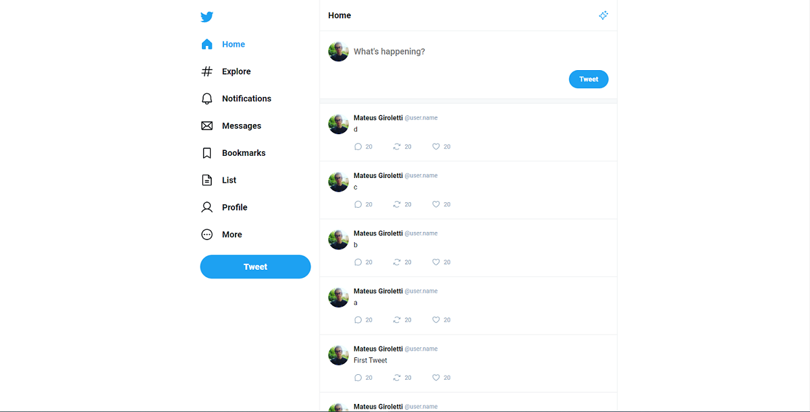

# Twitter UI

This is a simple clone of twitter interface. The objective is to apply the knowledge gained in ReactJs.

## Technologies used

<ul>
   <li>Typescript</li>
   <li>React</li>
   <li>Vite</li>
   <li>CSS</li>
</ul>

## Interface



## How to use?

Clone on your machine:

```console
git clone https://github.com/mateusgiroletti/Twitter-UI.git
```

Change to project directory and install dependencies via npm:

```console
cd Twitter-UI && npm i
```

And to run the developed interface:

```console
npm run dev
```

The application is available at:

```console
http://localhost:5173/
```